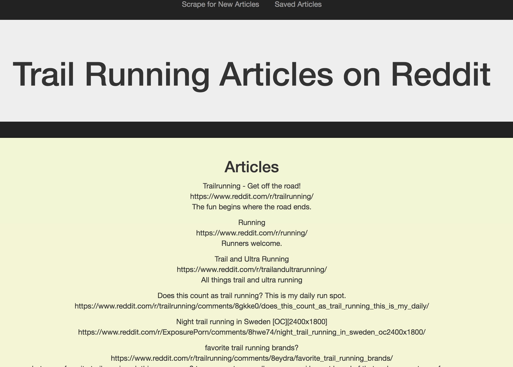
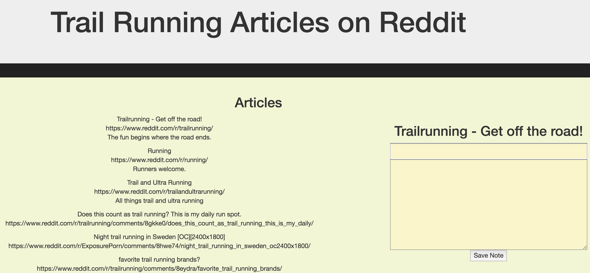
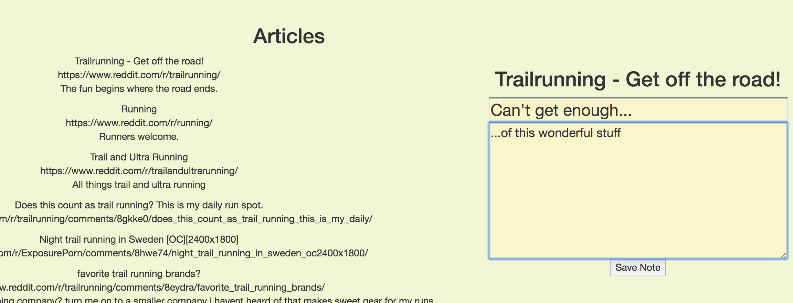

# NewsTracker - TrailRunning SubReddit Edition
A simple app that allows commenting on posted news items.

## What does it do?

This app scrapes the Trail Running subReddit page on Reddit and neatly assembles identical rows containing article title, link to the article, and any summary if available.  

It will also allow the user to comment on articles.

## What libraries does it use?

* Express
* BodyParser
* Mongoose
* Logger
* Cheerio
* Axios

## Future Improvements
* The ability to save articles of interest
* The ability to persist comments on articles of interest
* User authentication

###Shouts Out:
The fuel for this fire:
* Andrew, Jacob, and Valarie
* Childish Gambino - "This is America"